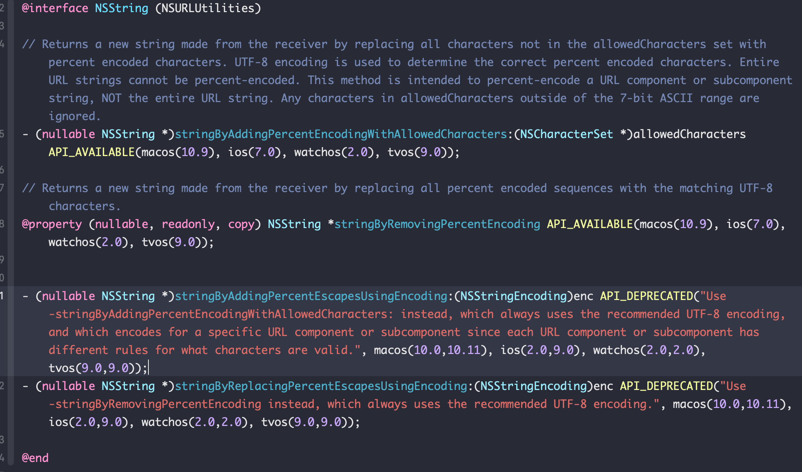

### 1、URL编码规则

Url编码通常也被称为百分号编码，编码方式非常简单，使用%加上两位十六进制的字符——代表一个字节的十六进制形式。

#### ASCII字符

例如 `a` 在US-ASCII码中对应的字节是 `0x61`，那么Url编码之后得到的就是 `%61` ，我们在地址栏上输入 `http://g.cn/search?q=%61%62%63` ，实际上就等同于在google上搜索 `abc` 了。

又如 `@` 符号在ASCII字符集中对应的字节为 `0x40`，经过Url编码之后得到的是 `%40`。

#### 非ASCII字符

需要使用ASCII字符集的超集进行编码得到相应的字节，然后对每个字节执行百分号编码。对于Unicode字符，RFC文档建议使用utf-8对其进行编码得到相应的字节，然后对每个字节执行百分号编码。如"中"使用UTF-8字符集得到的字节为`0xE4 0xB8 0xAD` ，经过Url编码之后得到`%E4%B8%AD`。

### 2、URL合法字符

HTTP URL 使用的RFC3986编码规范，RFC3986文档规定，URL中只允许包含以下五种： 

1. 英文字母`（a-z A-Z）`

2. 数字`（0-9）`

3. `-_.~` 4个特殊字符

4. 所有保留字符，RFC3986中指定了以下字符为保留字符（英文字符）: `! $ & ' ( ) * + , / : ; = ? @ # [ ]`
5. 编码标记符号 %

所以，当URL整体进行编码的时候，前四种符号都不会被编码，其他符号则会被编码为%格式。

当我们对URL参数进行编码时，则会产生问题，eg：`https://www.baidu.com/path?params1=xxx&params2=a&b`。这里的参数 `params2` ，值为 `a&b` 。此时会破坏URL的整体格式，导致URL整体识别失败。

**说明**：`~ # []` 这四个字符是否被转码成百分号编码，因系统不同会有不同。在iOS上，`# []` 这3个字符会被编码。即在iOS上，第4种为 `! $ & ' ( ) * + , / : ; = ? @ `

### 3、iOS端URL具体编码处理

1. URL编码和解码是成对

   URL编码和解码是一个可逆的过程，编码和解码的逻辑是翻转对应的。 成对有两层含义: 1、两个方法的逻辑对应。一个固定的编码方式，也对一个固定的逆向解码方式，反之亦然。

2. 编码和解码的次数也要一一对应。

例如： `%26`

第一次URL编码后：`%2526`，这是因为 `%` 的ASCII码十六进制为25，被编码为 `%25` 。数字默认不编码，所以结果为 `%2526` 。

第二次URL编码后：`%252526`，原理同上

正常解码逻辑：

第一次URL解码后：`%2526`，这是因为`%252526` 第一次解码，会将第一个 `%25` 解码为 `%` ，其余不需要解码，所以结果为 `%2526` 。

第二次URL解码后：`%26`， 原理同上

第三次URL解码后：`&`， 这是因为 `%26` 会被看做需要解码，从而根据ASCII码被解码为 `&` 。

因此，URL编码和解码必须是成对出现的。

### 4、编码API



#### 方式一：stringByAddingPercentEscapesUsingEncoding

```objectivec
NSString *urlStr = @"你好0123456789abcxyzABCXYZ-_.~&!*'();:@&=+$,/?#[]% ";
NSString *encodingString = [urlStr stringByAddingPercentEscapesUsingEncoding:NSUTF8StringEncoding];
NSLog(@"url编码 = %@",encodingString);
```

 打印结果是

```
url编码 = %E4%BD%A0%E5%A5%BD0123456789abcxyzABCXYZ-_.~&!*'();:@&=+$,/?%23%5B%5D%25%20
```

`0123456789abcxyzABCXYZ-_.~&!*'();:@&=+$,/?` 这些字符不会被编码成%编码， `#` 、`[`、`]`、`%` 、` `（空格）和中文字符等都会被编码。

这种方式，符合RFC3986编码规范，但是会造成上文说的问题。

#### 方式二：CFURLCreateStringByAddingPercentEscapes

```objective-c
// 方式二编码，定义一个需要转义的合法字符集

// 定义空字符集
NSString *encodeStr = (NSString *)CFBridgingRelease(CFURLCreateStringByAddingPercentEscapes(kCFAllocatorDefault, (CFStringRef)urlStr, NULL, (CFStringRef)@"", kCFStringEncodingUTF8));
NSLog(@"url编码2-1 = %@",encodeStr);

// 定义 :!*();@/&?+$,=' 字符集
NSString *encodeStr2 = (NSString *)CFBridgingRelease(CFURLCreateStringByAddingPercentEscapes(kCFAllocatorDefault, (CFStringRef)urlStr, NULL, (CFStringRef)@":!*();@/&?+$,='", kCFStringEncodingUTF8));
NSLog(@"url编码2-2 = %@",encodeStr2);
```

 打印结果是

```
url编码2-1 = %E4%BD%A0%E5%A5%BD0123456789abcxyzABCXYZ-_.~&!*'();:@&=+$,/?%23%5B%5D%25%20
url编码2-2 = %E4%BD%A0%E5%A5%BD0123456789abcxyzABCXYZ-_.~%26%21%2A%27%28%29%3B%3A%40%26%3D%2B%24%2C%2F%3F%23%5B%5D%25%20
```

可以看到，当我们对需要转义的合法字符集传入空集，此时效果和 `stringByAddingPercentEscapesUsingEncoding` 一样。为了解决上文的问题，我们这里可以传入需要转义的合法字符集 `:!*();@/&?+$,='`。

#### 方式三：stringByAddingPercentEncodingWithAllowedCharacters

iOS9之后苹果建议 使用新方法 `stringByAddingPercentEncodingWithAllowedCharacters：`。

苹果对该方法的注解：不对AllowedCharacters字符集中的字符编码，其他所有字符都将编码为百分号编码字符。utf-8编码用于确定正确的编码字符百分比。<font color='red'>不能对整个URL字符串进行百分比编码。此方法用于对URL组件或子组件字符串进行百分比编码，而不是对整个URL字符串进行百分比编码。</font>

```objective-c
// 方式三编码
// 允许[NSCharacterSet URLQueryAllowedCharacterSet]字符集中的字符不进行编码
NSString *encodeStr3 = [urlStr stringByAddingPercentEncodingWithAllowedCharacters:[NSCharacterSet URLQueryAllowedCharacterSet]];
NSLog(@"url编码3-1 = %@",encodeStr3);

// 允许[0-9, a-z, A-Z, -_.~]字符集中的字符不进行编码，即RFC3986标准里面1、2、3三种。
NSCharacterSet *characterSet1 = [NSCharacterSet characterSetWithCharactersInString:@"0123456789abcdefghijklmnopqrstuvwxyzABCDEFGHIJKLMNOPQRSTUVWXYZ-_.~"];
NSString *encodeStr4 = [urlStr stringByAddingPercentEncodingWithAllowedCharacters:characterSet1];
NSLog(@"url编码3-2 = %@",encodeStr4);

// 对所有字符均进行编码
NSCharacterSet *characterSet = [NSCharacterSet characterSetWithCharactersInString:@""];
NSString *encodeStr5 = [urlStr stringByAddingPercentEncodingWithAllowedCharacters:characterSet];
NSLog(@"url编码3-3 = %@",encodeStr5);
```

`[NSCharacterSet URLQueryAllowedCharacterSet]` 字符集包含的字符为：`!$&'()*+,-./0123456789:;=?@ABCDEFGHIJKLMNOPQRSTUVWXYZ_abcdefghijklmnopqrstuvwxyz~` ，即 `[0-9, a-z, A-Z, -_.~, !$&'()*+,/:;=?@#] `，也就是上文标准中的前四种。

打印结果是

```
url编码3-1 = %E4%BD%A0%E5%A5%BD0123456789abcxyzABCXYZ-_.~&!*'();:@&=+$,/?%23%5B%5D%25%20
url编码3-2 = %E4%BD%A0%E5%A5%BD0123456789abcxyzABCXYZ-_.~%26%21%2A%27%28%29%3B%3A%40%26%3D%2B%24%2C%2F%3F%23%5B%5D%25%20
url编码3-3 = %E4%BD%A0%E5%A5%BD%30%31%32%33%34%35%36%37%38%39%61%62%63%78%79%7A%41%42%43%58%59%5A%2D%5F%2E%7E%26%21%2A%27%28%29%3B%3A%40%26%3D%2B%24%2C%2F%3F%23%5B%5D%25%20
```

可以看到：

1. 编码3-1效果等同于 stringByAddingPercentEscapesUsingEncoding，不符合我们的要求。

2. 编码3-2效果等同于编码2-2，符合要求
3. 编码3-3会对所有字符进行编码，符合要求

### 5、解码API

#### stringByRemovingPercentEncoding

```objective-c
// 解码1-1
NSString *decodedString = [encodingString stringByRemovingPercentEncoding];
NSLog(@"url解码 = %@",decodedString);

// 解码2-2
NSString *decodedStr2 = [encodeStr2 stringByRemovingPercentEncoding];
NSLog(@"url解码2-2 = %@",decodedStr2);

// 解码3-3
NSString *decodedStr3 = [encodeStr5 stringByRemovingPercentEncoding];
NSLog(@"url解码3-3 = %@",decodedStr3);
```

打印结果是

```
url解码    = 你好0123456789abcxyzABCXYZ-_.~&!*'();:@&=+$,/?#[]%
url解码2-2 = 你好0123456789abcxyzABCXYZ-_.~&!*'();:@&=+$,/?#[]%
url解码3-3 = 你好0123456789abcxyzABCXYZ-_.~&!*'();:@&=+$,/?#[]%
```

可以看到，不论是如何进行的URL编码，解码都可以正确解出原始数据。

### 6、最优方式

从上述实验可以看出，编码2-2、编码3-2、编码3-3的方式，都符合我们的要求，即对URL的某个子组件进行URL编码。

编码2-2的缺点：目前CFURLCreateStringByAddingPercentEscapes方法已经弃用

编码3-2的缺点：字符集创建不优雅

编码3-3的缺点：全部编码后，会导致URL长度大幅增加，可能触发URL最大长度截断逻辑

目前比较推荐的是使用 编码2-2 或 编码3-2。解码统一使用 `stringByRemovingPercentEncoding` 即可。

这里重点提一个误区：很多小伙伴认为多次URLDecode是不会有问题的，这里上文第3节已经解释过了。还需要注意的有URLDecode 是 `nullable` 的，即有可能会返回 `nil` 。eg:

```objective-c
NSString *decodedStr4 = [@"%HJ" stringByRemovingPercentEncoding];
NSLog(@"url解码4-1 = %@",decodedStr4);
//打印结果如下：
//url解码4-1 = (null)
```

这里在开发过程中一定要注意，防止程序因空值crash。
